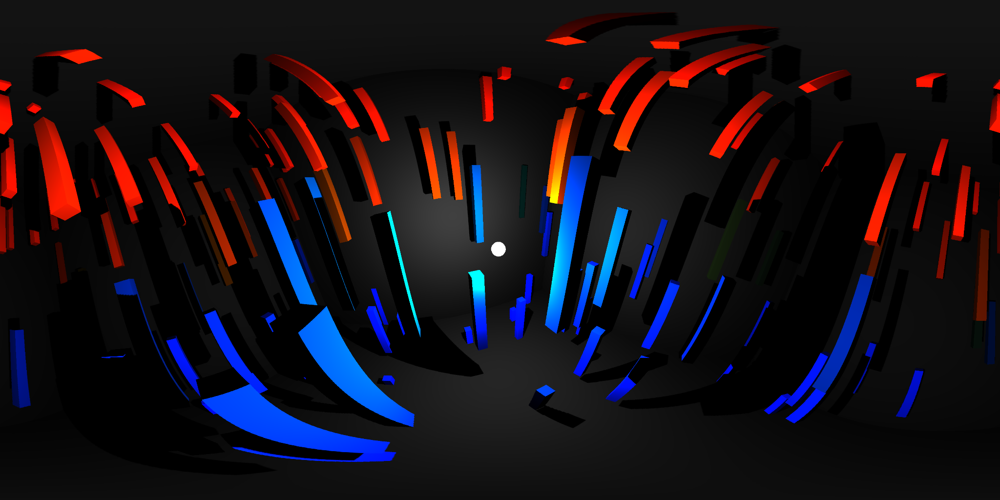

# equirect

Equirectangular camera extension for THREE.js



Installation:
```
npm install @meatbags/equirect
```

Example usage:
```javascript
let scene = new THREE.Scene();
let renderer = new THREE.WebGLRenderer();
let equirectCamera = new EquirectangularCamera(1024);

// add objects to scene
...

// update equirect camera
equirectCamera.position.set(10, 2, 0);
equirectCamera.lookAt(0, 0, 0);
equirectCamera.update(renderer, scene);

// render scene
renderer.render(equirectCamera.scene, equirectCamera.camera);
```
